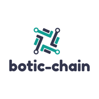

# Welcome to Botic-Chain

 

## What

A Decentralized Platform for Connecting Autonomous Robots

## Why

Every industry is trying to integrate robotics one way or another. Autonomous Robots market is valued at $1.9B in 2019 by a market research. It is predicted to grow at a rate of 29% AGR.

## How

## Project Timeline

##

## Types

- `mkdocs new [dir-name]` - Create a new project.
- `mkdocs serve` - Start the live-reloading docs server.
- `mkdocs build` - Build the documentation site.
- `mkdocs -h` - Print help message and exit.

## Project layout

    mkdocs.yml    # The configuration file.
    docs/
        index.md  # The documentation homepage.
        ...       # Other markdown pages, images and other files.
