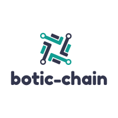

# Welcome to Botic-Chain

botic-chain is a decentralized platform for connecting autonomous robots. The objective of botic-chain is to connect various autonomous robots using a blockchain platform. 

## Introduction

Every industry is trying to integrate robotics one way or another. Autonomous Robots market is valued at $1.9B in 2019 by a market research and it is predicted to grow at a rate of 29% AGR. Most of these autonomous robots are used for industrial applications. The more accessible version of these robots are drones which has a huge commercial market. In United States alone, there were 1.7 million drones registered. These operate on an individual network only for specific purposes. There is currently no common platform for all these robots and drones to connect and collaborate.

## Benefits of Decentralization

This is analogous to the various financial services offered by various banks and financial organizations. The recent advent of decentralized finance popularly called as **DeFi** enabled by blockchain technologies such as smart contracts and trustless shared ledgers, has enabled various financial services such as savings, investing, lending, insurance and trading to be integrated with each other on a common blockchain network. Anyone with a crypto currency wallet and cryptocurrency can participate in these automated systems.

## Vision DeRo

Similar to **DeFi**, if all the robotic services can be integrated on a common platform, along with Artificial Intelligence algorithms, there will be no limit to the efficiency of operations which can be achieved.  

We call it, **Vision DeRo**. Imagine if you could rent out your autonomous robot, say a drone which is parked on top of your roof or on your balcony, which can be deployed by anyone having verified credentials and use it for making an aerial footage of their event. What if the user is trying to sabotage the drone or use it for an illegal. This is where the AI algorithms comes in and the drone automatically detects abnormal usage and by communicating with AI algorithms and comes back to its owner. This is our vision for giving public utility to all autonomous robots. We plan to build this on public blockchain networks like Ethereum & Polkadot. Currently Robonomics.network offers a readily available solution integrating ROS operating system with their own network.  

For robotic companies, which are bound by their corporate regulations we offer a more private platform based on HyperLedger Besu where the platform allows only a consortium of companies to participate. HyperLedger Besu has been selected due to its Ethereum compatibility which can be easily integrated into the public platform.
